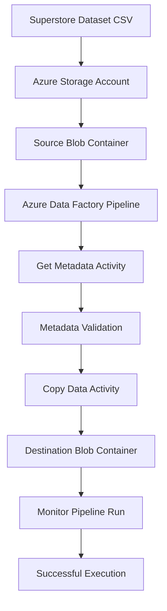

# azure-data-pipeline-adf-project

## Author
Himanshi Bhadauriya

## Project Overview
This project demonstrates an end-to-end Azure Data Pipeline using Azure Storage Account and Azure Data Factory (ADF).

## Objective
To understand Azure cloud concepts and build an end-to-end data pipeline using Azure Storage Account and Azure Data Factory.

## Services Used
- Azure Resource Group
- Azure Storage Account
- Azure Blob Storage
- Azure Data Factory (ADF)
- IAM (Identity and Access Management)

## Architecture

Source CSV File
↓
Source Blob Container
↓
Get Metadata Activity
↓
Copy Data Activity
↓
Destination Blob Container

## Implementation Steps

1. Created Resource Group
2. Created Storage Account
3. Created Blob Containers
4. Uploaded Superstore Dataset
5. Created Azure Data Factory
6. Configured Linked Service
7. Created Source and Destination Datasets
8. Added Get Metadata Activity
9. Added Copy Data Activity
10. Executed Pipeline
11. Published Pipeline
12. Configured IAM Roles

## Results

- Successfully validated metadata using Get Metadata activity.
- Successfully copied CSV file from source container to destination container.
- Pipeline execution completed successfully.
- Monitoring verified through ADF Monitor tab.

## Dataset

Superstore Dataset:
https://www.kaggle.com/datasets/vivek468/superstore-dataset-final

## Screenshots

All project screenshots are available in the `screenshots` folder.

## Author

**Himanshi Bhadauriya**
## Architecture Flow

